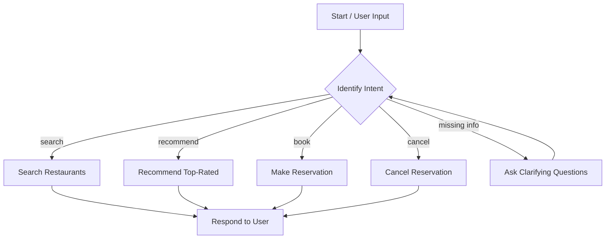

# Use case Template for Assignment

## Goal

### Long Term Goal

To develop a conversational restaurant reservation agent powered by LLMs that streamlines the process of discovering, recommending, and booking restaurants in a natural, user-friendly interface.

### Success Criteria

* Users can complete a restaurant reservation end-to-end with minimal back-and-forth
* Bot correctly interprets intent and calls appropriate tools
* Response time under 3 seconds per interaction
* At least 90% success rate in completing valid reservations
* Deployment to at least 2 cities within 3 months of launch

## Use Case (100 words)

Imagine a user landing in a new city and needing to quickly find a good restaurant and make a booking. The AI Reservation Agent acts as a personal concierge, understanding natural language inputs such as "Find a sushi place near Indiranagar for 4 people at 7 PM" or "Book something romantic in Bandra tomorrow." It recommends top venues based on ratings, cuisine, and availability, and handles bookings with minimal friction. It can also modify, cancel, or clarify reservations. This eliminates the friction of app-based filters, comparisons, and form-filling, especially for tourists, busy professionals, and last-minute planners.

## Key Steps (Bot flow)

1. User greets or asks for restaurant help.
2. Bot identifies user intent: search, recommend, book, or cancel.
3. Bot calls `search_restaurants` or `recommend_restaurants` as needed.
4. If booking intent is identified:

   * Bot gathers missing info (time, name, guests).
   * Bot calls `make_reservation` with collected details.
5. On cancelation, it asks for booking ID and calls `cancel_reservation`.
6. Bot confirms actions taken and offers next steps.

## State Transition Diagram

## Bot Features

* **Key Specs**:

  * 100+ restaurants with name, location, cuisine, rating, capacity
  * LLM-based intent recognition (LLama 3-8B or similar)
  * Tool calling to execute actions
* **Knowledge Bases**: Custom restaurant JSON dataset
* **Tools Required**:

  * `search_restaurants`, `recommend_restaurants`, `make_reservation`, `cancel_reservation`
* **Languages**: English (extensible to others)
* **Feature Complexity**:

  * Green: Search, Recommend, Cancel
  * Yellow: Book with missing parameters
  * Red: Multi-turn clarifications, natural errors
* **Integrations**:

  * Groq API for LLM
  * Streamlit frontend

## Scale up / Rollout Strategy

* Phase 1: MVP launch in one city (e.g., Bangalore)

  * Internal QA with 50 test cases
  * Shadow deployments with real users
* Phase 2: Launch to early partner restaurants

  * Collect feedback and usage patterns
* Phase 3: Add language support, voice input, WhatsApp channel
* Phase 4: Expand to other metros and automate restaurant onboarding

## Key Challenges

* Natural language parsing without overfitting or hallucination
* Handling missing information gracefully
* Maintaining real-time reservation accuracy (sync issues)
* Edge case recovery (invalid date/time, over-capacity requests)
* Scaling knowledge base as restaurant count grows
* API rate limits and latency
* UX tradeoffs between flexibility and control
